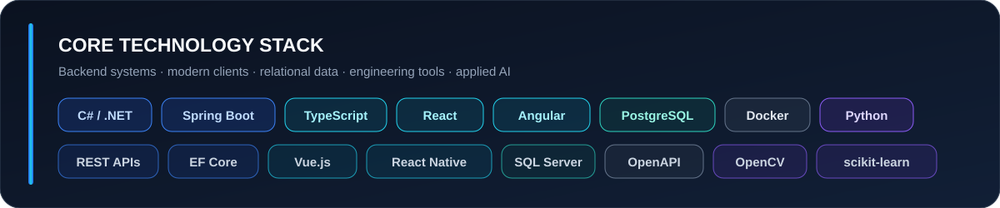

<div align="center">



### Building dependable products across APIs, data, web, mobile, and applied AI

[**LinkedIn**](https://www.linkedin.com/in/antonio-puceski-9911b1239/) &nbsp;·&nbsp; [**Email**](mailto:puceskia@gmail.com) &nbsp;·&nbsp; [**GitHub**](https://github.com/Ton4ee)

</div>

## About me

Software engineering graduate with professional experience contributing to full-stack applications, software integrations, backend services, relational databases, frontend development, and software quality assurance.

I build maintainable web and mobile applications across backend APIs, data layers, and modern frontend frameworks. My project work spans ASP.NET Core, Spring Boot, React, Angular, React Native, PostgreSQL, applied machine learning, and computer-vision interfaces.

> I value accurate documentation, clear architecture, practical testing, and software that can be understood and maintained by the next engineer.

## Technology



| Focus | Technologies |
| :--- | :--- |
| **Backend engineering** | `C#` `.NET` `ASP.NET Core` `Java` `Spring Boot` `REST APIs` `EF Core` `JPA` |
| **Web & mobile clients** | `TypeScript` `JavaScript` `Angular` `React` `Vue.js` `React Native` |
| **Data platforms** | `PostgreSQL` `SQL Server` `MySQL` `H2` |
| **Delivery & collaboration** | `Git` `GitHub` `Docker` `Jira` `Swagger / OpenAPI` |
| **Python & applied AI** | `Python` `pandas` `scikit-learn` `OpenCV` `MediaPipe` |

## Selected work

<table>
<tr>
<td width="50%" valign="top">

### 🏋️ [GymTracker](https://github.com/Ton4ee/GymTracker)

ASP.NET Core and PostgreSQL fitness-tracking API with workout plans, completed sessions, favorites, progress history, dashboard statistics, and WGER synchronization.

`C#` `.NET` `EF Core` `PostgreSQL`

</td>
<td width="50%" valign="top">

### 💳 [Personal Finance Manager](https://github.com/Ton4ee/-personal-finance-manager)

Spring Boot and React/TypeScript finance application using JPA with PostgreSQL/H2 and Recharts visualizations.

`Java` `Spring Boot` `React` `TypeScript`

</td>
</tr>
<tr>
<td width="50%" valign="top">

### 🛡️ [Smart Incident Detection](https://github.com/Ton4ee/Smart-Incident-Detection-Dashboard-)

Random Forest training pipeline, FastAPI prediction service, and React visualization dashboard.

`Python` `scikit-learn` `FastAPI` `React`

</td>
<td width="50%" valign="top">

### 🎸 [Guitar Shop](https://github.com/Ton4ee/Guitar-Shop)

React and TypeScript storefront using Apollo GraphQL, routing, multilingual content, filtering, and infinite scrolling.

`React` `TypeScript` `GraphQL`

</td>
</tr>
<tr>
<td colspan="2" valign="top">

### 👁️ [Computer Vision Sensor Hub](https://github.com/Ton4ee/Python-camera-sensor-project)

OpenCV and MediaPipe interface for landmark-based face, hand, gesture, and head-direction detection.

`Python` `OpenCV` `MediaPipe`

</td>
</tr>
</table>

## How I work

```text
Understand the problem  →  Design the boundary  →  Build the smallest clear solution
        ↑                                                        ↓
Learn from feedback     ←  Verify behavior       ←  Document decisions
```

<div align="center">

### Let’s build something useful.

[LinkedIn](https://www.linkedin.com/in/antonio-puceski-9911b1239/) · [puceskia@gmail.com](mailto:puceskia@gmail.com)

</div>
